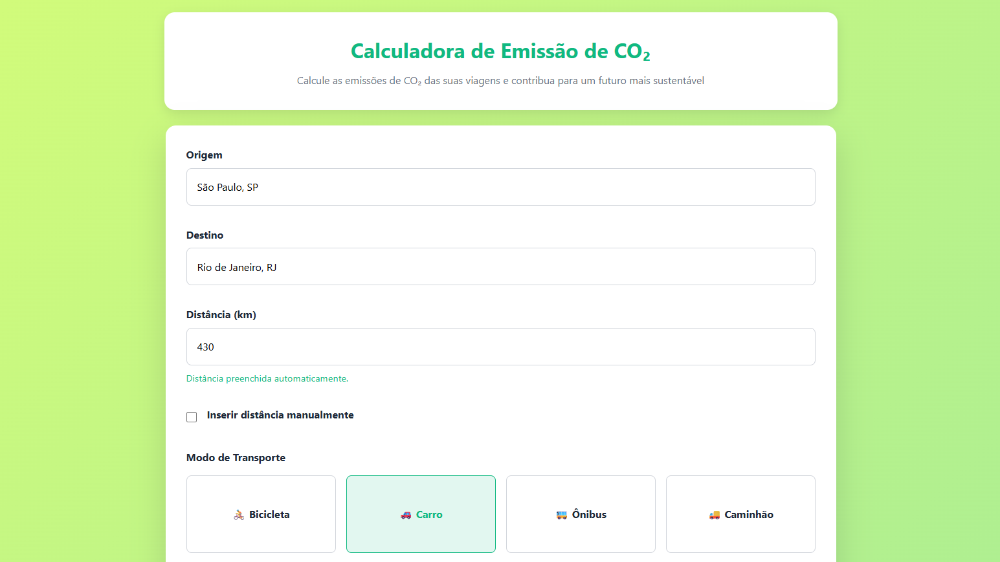
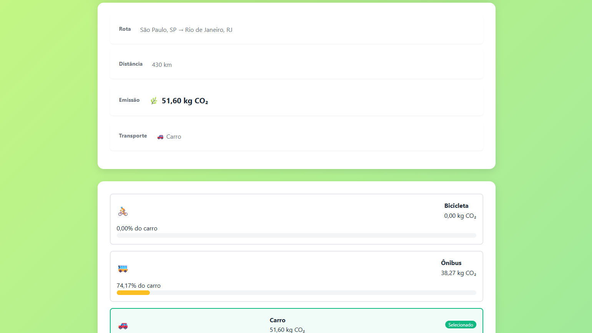
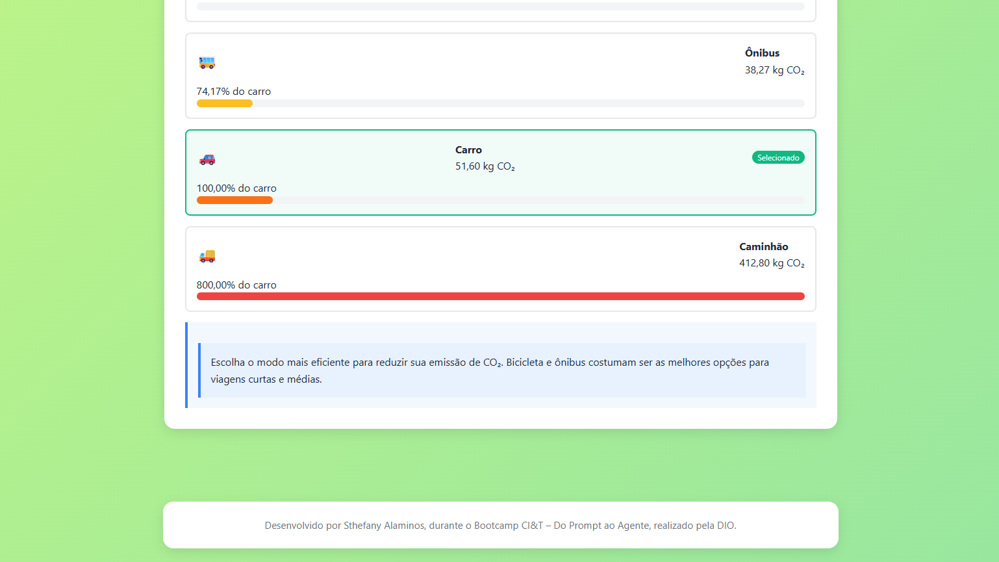

# Calculadora de Emissão de CO₂
 
> Ferramenta web interativa para estimar o impacto ambiental de viagens, ajudando usuários a tomar decisões de transporte mais conscientes e sustentáveis.

<div align="center">



</div>

---
A **Calculadora de Emissão de CO₂** é uma aplicação front-end que simula o impacto ambiental de deslocamentos, estimando a quantidade de carbono emitida com base em fatores como distância percorrida, modal de transporte e perfil do trajeto.
 
O projeto foi desenvolvido com o objetivo de promover consciência ambiental, oferecendo ao usuário uma comparação clara entre diferentes meios de transporte e incentivando escolhas mais sustentáveis no dia a dia.
 
---
## Funcionalidades
 
- **Cálculo automático de distância** entre cidades de origem e destino
- **Inserção manual de distância**, caso preferível
- **Suporte a múltiplos modais de transporte:**
  - Bicicleta
  - Carro
  - Ônibus
  - Caminhão
- **Exibição dos resultados** com a estimativa de CO₂ emitido (em kg)
- **Comparativo entre modais**, facilitando decisões mais sustentáveis
- **Autocomplete de cidades** para facilitar o preenchimento

---
## Tecnologias Utilizadas
 
- **HTML5** - estrutura semântica e acessível
- **CSS3** - estilização responsiva com metodologia BEM
- **JavaScript (ES6+)** - lógica de cálculo, manipulação de DOM e interatividade

---
## Estrutura do Projeto
 
```
calculadora-co2/
│
├── index.html              # Página principal da aplicação
│
├── css/
│   └── style.css           # Estilos da aplicação
│
└── js/
    ├── routes-data.js      # Base de dados de rotas e distâncias
    ├── config.js           # Configurações e fatores de emissão 
    ├── calculator.js       # Lógica de cálculo de CO₂
    ├── ui.js               # Manipulação da interface do usuário
    └── app.js              # Inicialização e orquestração
```
 
---
## Como Usar
 
1. Digite a **cidade de origem** no campo correspondente;
2. Digite a **cidade de destino**;
3. A **distância será preenchida automaticamente**, ou ative a opção de inserção manual;
4. Selecione o **modo de transporte** desejado;
5. Clique em **"Calcular Emissão"**;
6. Veja o resultado e a comparação com outros modos.

---
## Motivação
 
Com o crescimento das preocupações ambientais, entender o impacto das nossas escolhas de deslocamento é um passo importante para a sustentabilidade. Este projeto busca tornar essa informação acessível e visual, estimulando a reflexão sobre alternativas de transporte com menor pegada de carbono.

---
## Autoria
Desenvolvido por Sthefany Alaminos, durante o Bootcamp CI&T – Do Prompt ao Agente, realizado pela DIO.